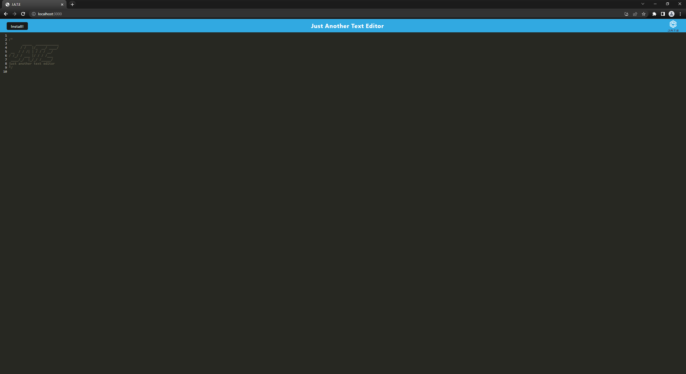
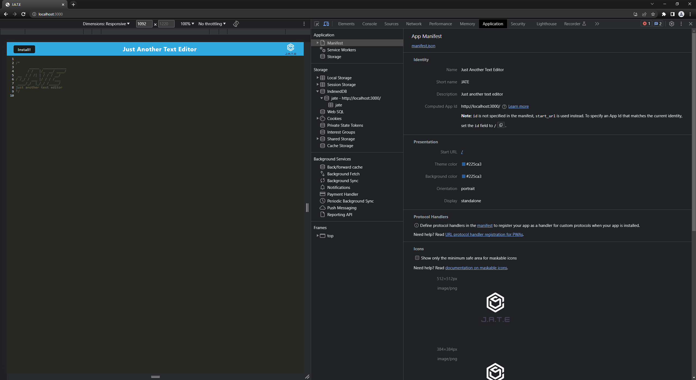

# Challenge-19-PWA-Text-Editor

## Description
This is a text editor that can be used online. It is a progressive web application that can be installed on your device. It uses a service worker to cache the files needed to run the application. It also uses IndexedDB to store the data that is entered into the text editor.

## Table of Contents
* [Installation](#installation)
* [Usage](#usage)
* [License](#license)

## Installation
To install the application locally:

1. Clone the repository to your local machine.
2. Navigate to the root directory and run `npm install` to install the dependencies.
3. Run `npm start` to start the server.
4. Navigate to `localhost:3001` in your browser to view the application.

## Usage
To use the application click on the link below: 

## License
MIT License